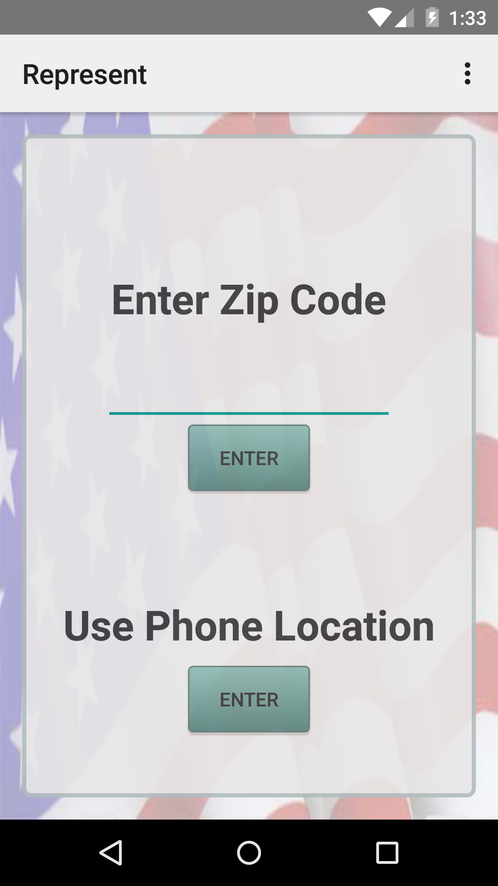

# PROG 02: Represent!

User can input a zip code or use their phone location to find out who their local representatives are, their last twitter message, and even contact them via E-mail. 

A more detailed view is also available if user wants to know some of the committees a certain rep is on and their recent sponsered bills. 

Has some minor interactions with a smartwatch.

## Authors

Huahong Dai([tonydai8808@berkeley.edu](mailto:tonydai8808@berkeley.edu))

## Demo Video

See [demo] (https://vimeo.com/158875746)

## Screenshots

## Acknowledgments

Stackoverflow
Android tutorial throughout the web
